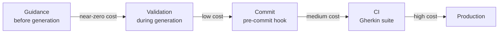
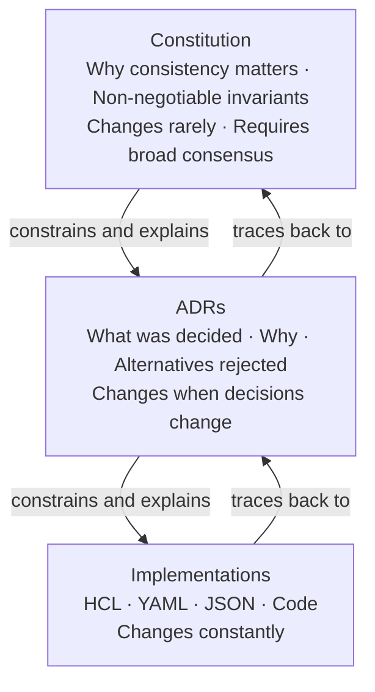

# The 10 Principles of Constitutional Governance

These principles elaborate on the values stated in the Manifesto. Each principle is a behavioral commitment — a claim about how a technically governed organization should operate, and why.

---

## 1. Governance is code.

Rules that cannot be version-controlled, reviewed, and tested are not governance — they are suggestions.

Every convention, standard, and architectural decision must exist as a file in a repository, subject to the same change process as production code: pull request, review, approval, merge, deployment. Not a wiki page. Not a Confluence doc. Not a Slack pinned message. A file. In a repository. With a history.

This matters because code is the only artifact a technical organization reliably treats with discipline. Code is diffed, reviewed, tested, and deployed. If your rules are not code, they will not receive this discipline. They will drift. They will become stale. They will become fiction.

Governance-as-code also makes rules auditable. You can ask: what were our naming conventions six months ago? What changed, and why? When did we decide to stop allowing the `dev` prefix in production? These questions have answers when governance is code. They do not have answers when governance is culture.

---

## 2. One source of truth.

No team should own a copy of the rules. Every team delegates rule authority to a single governance repository.

When a rule changes, it changes once and propagates everywhere. Distributed copies are technical debt.

The failure mode of distributed governance is silent divergence. Team A updates their copy of the naming convention. Team B does not. Two months later, a migration script written by Team B produces names that violate Team A's current standard. Nobody notices until the system is in production.

The solution is not better communication. The solution is structural: eliminate the copies. A single governance repository, a single `constitution.md`, a single `governance.yml`. Every team, every tool, every pipeline delegates to it. When it changes, everything changes. This is delegation over distribution — the organizational primitive of Constitutional Governance.

---

## 3. Rationale is not optional.

A rule without explanation is a rule that will be broken the moment the person who wrote it is unavailable.

Every decision must document what was decided, why it was decided, what alternatives were rejected, and what the consequences of the decision are. Architecture Decision Records (ADRs) are the legislative history of the organization.

The WHY is not decoration. The WHY is what allows the next person — human or AI — to apply judgment in a case the original author did not anticipate. A rule that says "topic names must have exactly 7 dot-separated segments" can be followed mechanically. A rule that says "7 segments because segment 4 encodes the team name, and our access control is segment-based" can be extended correctly to new cases.

ADRs are not just historical documentation. They are active governance artifacts. When a rule is questioned, the ADR is the answer. When a rule needs to change, the ADR is updated — not silently replaced, but amended, with the reason for the change recorded alongside the reason for the original decision.

---

## 4. AI agents are first-class governance consumers.

Governance systems that assume a human reader will fail as AI agents become primary contributors to codebases.

Rules must be structured, typed, and queryable by machines. An agent that can ask "is this topic name valid?" and receive a structured answer — valid/invalid, reason, canonical pattern — is a governed agent. An agent that must interpret prose documentation is ungoverned, because prose interpretation is unreliable and does not fail loudly when the prose is ambiguous or outdated.

This is the architectural commitment that distinguishes Constitutional Governance from documentation-based approaches. The MCP (Model Context Protocol) interface is not a convenience — it is the mechanism by which governance becomes machine-executable. An agent calling `validate_topic_name("payments.processed.v1")` and receiving `{"valid": false, "reason": "expected 7 segments, got 3"}` cannot misinterpret the rule. An agent reading a markdown document can.

The implication is design-forcing: governance rules must be expressed in a form that can be validated programmatically. If you cannot write a function that enforces the rule, the rule is not well-defined enough to be governed.

---

## 5. Enforcement is layered, not singular.

No single gate catches every violation at the right moment. Governance must be enforced at four progressive layers:

| Layer | Mechanism | Cost of miss |
|---|---|---|
| Guidance time | MCP tools queried by AI agent before generation | Near-zero |
| Validation time | Real-time validation during generation | Low |
| Commit time | Pre-commit hooks running validators locally | Medium |
| Integration time | CI pipeline running full Gherkin suite | High |

Each layer has a different cost of failure. A violation caught at guidance time costs a regeneration. A violation caught at integration time costs a review cycle, a failed build, and a fix commit. A violation that reaches production costs an incident.

The goal is not to make the CI layer more thorough — it is to push violations earlier, to the layer where they are cheapest to fix. An agent that queries the governance server before generating a resource name will produce fewer violations than one that only learns about conventions from a failed CI check.

The layers are also redundant by design. Not every team uses an AI agent. Not every change goes through pre-commit. CI is the safety net for everything that slips through earlier layers. The system is robust because it does not depend on any single layer functioning perfectly.

---

## 6. Constitutions constrain laws, laws constrain implementations.

Not all rules have equal authority. The governance hierarchy must be explicit:

**Constitutions** — domain-level principles. Why the organization values consistency in this domain. What the non-negotiable invariants are. These change rarely and require broad consensus to amend.

**ADRs** — specific decisions. What was decided, why, what alternatives were rejected. These are the statutes derived from constitutional principles. They change when the specific decision changes, which happens more frequently.

**Implementations** — the HCL, YAML, JSON, code that must conform to the ADRs. These change constantly. They must conform to the ADRs. The ADRs must conform to the constitution.

A validator that enforces an ADR rule is not an arbitrary check — it is constitutional law made executable. When someone asks "why does this validator exist?", the answer is: "because ADR-007 decided X, and ADR-007 was written to fulfill the principle stated in the kafka constitution section on access control."

This hierarchy makes governance legible. Any change can be traced upward: this implementation follows this rule, which follows this decision, which follows this principle. Any principle can be traced downward: this value manifests in these decisions, which are enforced by these checks.

---

## 7. Governance must be discoverable.

A rule that cannot be found is a rule that does not exist.

Any agent, tool, or team member must be able to enumerate what domains are governed, what rules apply to each domain, and what the rationale behind each rule is — without prior knowledge of the governance repository's structure.

Discovery is not search. Discovery is enumeration: list all governed domains, list all ADRs in a domain, list all checks that apply to a given domain. A governed agent begins a new session by discovering what it needs to know, not by relying on memory from a previous session that may have been stale.

This principle has implementation consequences. The governance server must expose `list_domains()`, `list_adrs()`, `list_checks(domain)` as explicit tools — not as a byproduct of file browsing. The governance repository structure must be deterministic enough to allow programmatic enumeration. Rules must be organized so that a query like "what governs Kafka topics?" returns a complete answer.

Discoverability is also why rationale is mandatory. An ADR title without context is discoverable but not useful. "ADR-007: Schema registry subjects must use BackwardCompatible" is discoverable. "ADR-007" with no title is not.

---

## 8. Compliance must be verifiable.

Rules without tests are aspirations. Every governance rule must have at least one executable check that verifies correct implementation and at least one that verifies incorrect implementation is rejected. These checks run in CI on every proposed change. A check that fails blocks the change.

The Gherkin format is recommended for governance checks because it is simultaneously human-readable (reviewable by non-engineers) and machine-executable (runnable in CI). A scenario that says "Given a topic name with 6 segments / When I validate it / Then it should be rejected with reason 'expected 7 segments'" is both documentation and test.

Verifiability creates accountability. If a rule has no executable check, it is impossible to know whether the organization is actually complying with it. Over time, unverified rules become cargo-cult governance — the rule exists in the repository, but nobody knows if it is being followed, and nobody is enforcing it.

The distinction between `@enforced` and `@wip` (or `@draft`) checks is critical. An `@enforced` check runs in CI and blocks merges. A `@wip` check documents an aspiration that has not yet been implemented as a validator. The distinction should be explicit in the governance repository, not implicit.

---

## 9. Governance evolves through amendment, not erasure.

Rules change. When they do, the history of what was decided and why must be preserved.

A rule is amended — the old decision is superseded, the reason for supersession is recorded — never silently replaced. An organization that cannot explain why its current rules differ from its former rules has lost institutional memory.

Silent erasure is one of the most common governance failures. An engineer updates a naming convention without recording why. Two years later, code written under the old convention is found in a legacy system. Nobody knows whether the old convention was wrong, whether the new convention applies retroactively, or whether the legacy code is compliant or not. The context that would resolve the ambiguity is gone.

Amendment discipline requires that every change to a governance rule be accompanied by: what changed, why, and what happens to implementations that followed the previous rule. This is what the ADR supersession mechanism provides. A superseded ADR is not deleted — it is marked `Superseded by ADR-NNN` and the new ADR explains the reason for the change.

---

## 10. The overhead of governance must be lower than the cost of its absence.

A governance system that slows teams down will be bypassed.

Constitutional Governance succeeds only if querying the rules is faster than guessing, validating a name is faster than having it rejected in code review, and finding the rationale for a decision is faster than reconstructing it from git history. The system must earn its adoption continuously.

This principle is a check on the other nine. It is easy to design governance systems that are technically complete but operationally burdensome. A pre-commit hook that adds 30 seconds to every commit will be disabled. An MCP tool that requires three queries to answer "is this topic name valid?" will be bypassed in favor of guessing. A Gherkin suite that takes 10 minutes to run will be skipped.

The design goal is zero-friction enforcement. Validators must be fast (sub-second for single-resource checks). MCP tools must return structured responses, not prose. The governance repository must be discoverable without documentation. Pre-commit hooks must fail fast and explain clearly.

When governance has lower overhead than its absence, adoption is not a change management problem — it is the path of least resistance.

---

*These principles are intentionally technology-agnostic. They apply whether your governance is implemented with Nomos, OPA, a homegrown script, or a well-maintained wiki with enforced CI checks. The methodology does not require any specific tool. The tools accelerate the methodology.*

---

→ [Back to README](README.md) | [Read the Manifesto](MANIFESTO.md)
