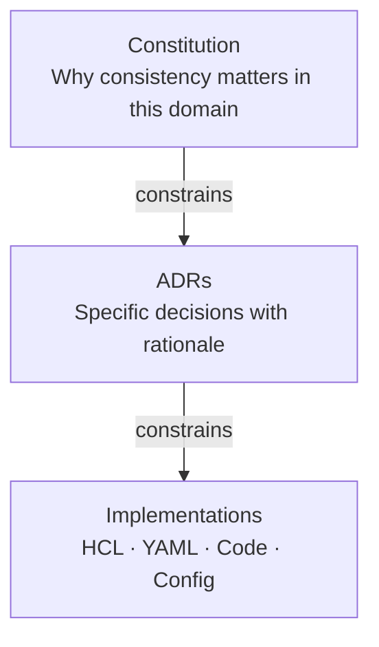
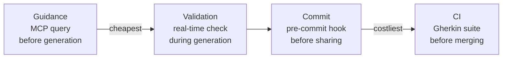
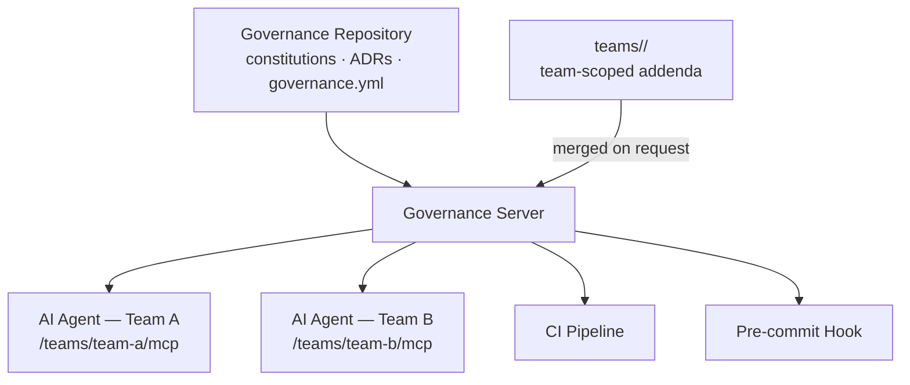

# Constitutional Governance

> *Rules that cannot be tested are not governance — they are suggestions.*

Constitutional Governance is a methodology for technical organizations that treats governance as infrastructure: written down, version-controlled, tested, and enforced automatically — for humans and AI agents alike.

---

## The problem

Most engineering organizations govern themselves by accident. Conventions live in wikis nobody updates. Architectural decisions are tribal knowledge that leaves with senior engineers. Standards circulate as PDFs and are forgotten within a week.

This was manageable when humans were the only contributors. It is not manageable when AI coding agents generate code at a rate that outpaces any review process — and carry no organizational memory between sessions.

**The agent is not unintelligent. It is uninformed. And the cost of being uninformed is paid by the humans who must catch and correct the violations.**

Constitutional Governance solves this by making rules explicit, machine-readable, and delegated from a single authority — so that every tool, every pipeline, and every AI agent operates under the same governance, automatically.

---

## Core values

We value:

- **Codified rules** over documented conventions
- **Delegated authority** over distributed copies
- **Automatic enforcement** over manual review
- **Structured rationale** over implicit knowledge
- **Machine-readable governance** over human-only interpretation

---

## How it works

A Constitutional Governance system has four components:

| Component | Role | Analogy |
|---|---|---|
| **Constitution** | Non-negotiable domain principles | Constitutional law |
| **ADRs** | Specific decisions with rationale | Statutes |
| **Validators** | Executable enforcement of the rules | Judiciary |
| **Gherkin checks** | Verifiable compliance tests | Audit |

### The governance hierarchy

Rules are not flat — they have authority levels. Constitutions constrain decisions, decisions constrain implementations.

### Enforcement is layered

Rules are enforced at four progressive gates. Violations caught earlier cost less to fix.

### Delegation over distribution

The central principle: no team owns a copy of the rules. Every agent, hook, and pipeline delegates to a single governance authority. When a rule changes, it changes once and propagates everywhere.

---

## Read the manifesto

→ [MANIFESTO.md](MANIFESTO.md)

→ [The 10 Principles](PRINCIPLES.md)

---

## Reference implementation

**Nomos** is the open-source governance server that operationalizes Constitutional Governance for engineering platforms. It exposes governance rules as MCP tools queryable by AI agents, as a CLI for pre-commit hooks, and as a Gherkin test suite for CI pipelines.

→ [implementations/nomos.md](implementations/nomos.md)

---

## Examples

- [Kafka platform governance](examples/kafka-platform.md)
- [REST API governance](examples/rest-api.md)

---

## Adopting Constitutional Governance

Constitutional Governance is not software — it is a methodology. You can adopt it today without any tooling:

1. Write a `constitution.md` for each technical domain your team owns
2. Record every significant architectural decision as an ADR
3. Identify your three most commonly violated conventions and write a validator for each
4. Run those validators in CI

The methodology scales from there. The tooling accelerates it.

---

## Contributing

Constitutional Governance is an open methodology. Contributions, critiques, domain examples, and implementations in other technology stacks are welcome.

→ [CONTRIBUTING.md](.github/CONTRIBUTING.md)

→ [GitHub Discussions](../../discussions)

---

*Constitutional Governance is not a product. It is a way of thinking about organizational rules that makes them as rigorous as the code those rules govern.*
