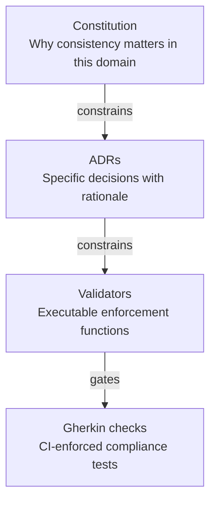
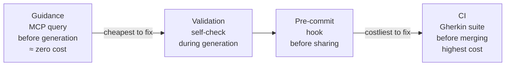
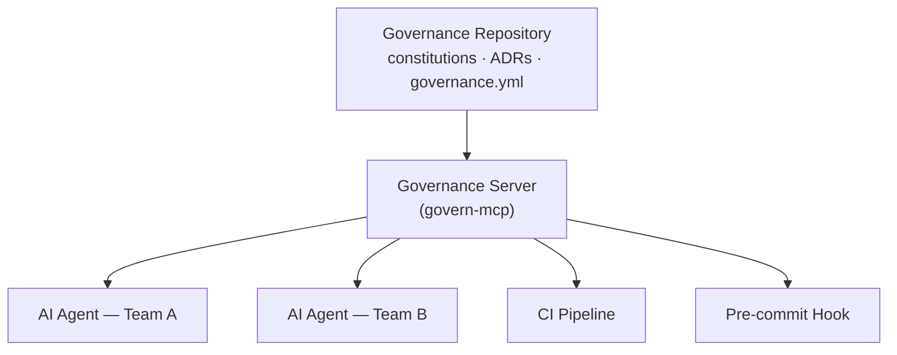

# Constitutional Governance

> *Rules that cannot be tested are not governance — they are suggestions.*

Constitutional Governance is a methodology for treating organizational rules as infrastructure: version-controlled, machine-readable, enforced automatically, and queryable by AI agents before they generate a single line of code.

---

## The problem nobody has solved yet

Your AI agents are stateless. Every session starts at zero — no memory of last week's architecture discussion, no knowledge of why your API follows a specific versioning convention, no awareness of the ADR your team debated for three weeks. The agent isn't unintelligent. **It is uninformed. And the cost of being uninformed is paid by the humans who must catch and correct the violations.**

Most organizations respond to this by writing better documentation. Longer READMEs. More detailed wikis. A Confluence doc with a bright yellow WARNING at the top.

Two months later: same violations. Different agents. Same ignorance.

The documentation approach was already fragile when humans were the only contributors. With AI agents generating code at rates that outpace any review process, it has broken completely. You need governance that machines can read, query, and act on — not governance that assumes someone will read a PDF.

---

## What this is

A four-layer methodology where governance rules are **specs**, not documents. Same discipline you apply to OpenAPI schemas or Avro definitions — versioned, testable, enforced — applied one layer up: to the organizational rules that determine whether the code is correct in the first place.

| Layer | Role | Enforcement point |
|---|---|---|
| **Constitution** | Non-negotiable domain principles — the *why* | Constrains all layers below |
| **ADRs** | Specific decisions with mandatory rationale | Constrains implementations |
| **Validators** | Executable functions returning `{valid, errors[], warnings[]}` | Generation time + pre-commit |
| **Gherkin checks** | BDD scenarios that gate CI | Every PR, no exceptions |

Each layer constrains the one below. Validators can't permit what constitutions prohibit. ADRs can't override constitutional principles. The authority chain is explicit and traceable.

---

## Why not OPA, Conftest, or a linter?

Good question. Those tools enforce rules at a specific point in the pipeline — usually CI. Constitutional Governance does something different:

**It makes rules queryable before generation.** Via MCP (Model Context Protocol), an AI agent can call `get_conventions()`, `get_constitution()`, and `validate_resource()` *before* producing output. The agent reads the spec, applies it, self-validates. The violation never happens. OPA catches violations after the fact. Constitutional Governance prevents them.

**It enforces rationale.** An ADR without a *why* is rejected. This matters for AI agents: a rule without rationale can't be applied to edge cases the rule-writers didn't anticipate. A principle with rationale can.

**It centralizes authority, not just enforcement.** No team owns a copy of the rules. Every agent config, CI pipeline, and pre-commit hook delegates to a single governance repository. One change propagates everywhere. No drift, no forks, no "which version of the convention are we on?"

**It catalogs systematic AI failures.** `get_knowledge("failures")` returns a structured catalog of the specific mistakes AI agents make on *your* platform. Not generic anti-patterns — your platform's patterns, queryable before generation. No linter does this.

---

## How it works

### The governance hierarchy



### Enforcement is layered — violations caught earlier cost less



### Delegation over distribution

No team owns a copy of the rules. Every consumer delegates to one source of truth.



When a rule changes, it changes once. Everything downstream inherits it automatically.

### The recommended agent workflow

```
1. get_knowledge("failures")    ← read what agents get wrong on this platform
2. get_conventions(domain)      ← load naming rules, valid enums, patterns
3. get_constitution(domain)     ← load non-negotiable principles
4. [generate the resource]
5. validate_resource(output)    ← self-check before returning
```

---

## In production

A platform team of 8 engineers at a retail multinational runs this on their data streaming platform: ~200 Kafka topics, ~1 MB/s throughput.

- PR review time related to governance: **reduced by 10x**
- Naming violations reaching production: **zero** — not reduced, eliminated. The pipeline doesn't let them through.
- Onboarding new engineers to platform conventions: from "read this doc and hope for the best" to "the tooling tells you what's wrong before you commit"

One note for skeptics: at some point, a Gherkin check was validating against an outdated dependency version, causing valid PRs to fail CI. It was detected, fixed, and merged like any other bug. The fix propagated automatically to every pipeline consuming the governance repo. This is what "governance as code" means in practice: when it's wrong, it fails visibly and is fixable. Better than governance that's wrong silently in a wiki for six months.

---

## Core values

- **Codified rules** over documented conventions
- **Delegated authority** over distributed copies
- **Automatic enforcement** over manual review
- **Structured rationale** over implicit knowledge
- **Machine-readable governance** over human-only interpretation

---

## Getting started

Constitutional Governance is a methodology first, tooling second. You can start today:

1. Write a `constitution.md` for one technical domain your team owns
2. Record your three most significant architectural decisions as ADRs — with rationale
3. Write a validator for your most commonly violated convention
4. Run it in CI

The methodology scales from there. The tooling accelerates it.

→ [Read the full manifesto](MANIFESTO.md)
→ [The 10 Principles](PRINCIPLES.md)
→ [Reference implementation: Nomos](implementations/nomos.md)

---

## Examples

- [Kafka platform governance](examples/kafka-platform.md)
- [REST API governance](examples/rest-api.md)

---

## Relationship to agentic patterns

Constitutional Governance implements several patterns catalogued by the [Agentic Patterns community](https://agentic-patterns.com):

| Pattern | Category | How it maps |
|---|---|---|
| [Versioned Constitution Governance](https://github.com/nibzard/awesome-agentic-patterns/blob/main/patterns/versioned-constitution-governance.md) | Reliability & Eval | The core methodology — governance rules versioned and enforced like code |
| [MCP Pattern Injection](https://github.com/nibzard/awesome-agentic-patterns/blob/main/patterns/mcp-pattern-injection.md) | Tool Use & Environment | `get_conventions()`, `get_constitution()`, `get_knowledge("failures")` called at generation time |
| [Spec-As-Test Feedback Loop](https://github.com/nibzard/awesome-agentic-patterns/blob/main/patterns/spec-as-test-feedback-loop.md) | Feedback Loops | Gherkin checks that gate CI |
| [Layered Configuration Context](https://github.com/nibzard/awesome-agentic-patterns/blob/main/patterns/layered-configuration-context.md) | Context & Memory | The four-layer hierarchy: Constitution → ADRs → Validators → Gherkin |
| [Memory Synthesis from Execution Logs](https://github.com/nibzard/awesome-agentic-patterns/blob/main/patterns/memory-synthesis-from-execution-logs.md) | Context & Memory | The failures catalog — platform-specific AI mistakes distilled into queryable context |
| [Incident-to-Eval Synthesis](https://github.com/nibzard/awesome-agentic-patterns/blob/main/patterns/incident-to-eval-synthesis.md) | Feedback Loops | Roadmap: violations that reach production automatically become new catalog entries |

---

## Contributing

Contributions, critiques, domain examples, and implementations in other stacks are welcome.

→ [CONTRIBUTING.md](.github/CONTRIBUTING.md)
→ [GitHub Discussions](../../discussions)

---

*Constitutional Governance is not a product. It is a way of thinking about organizational rules that makes them as rigorous as the code those rules govern.*
