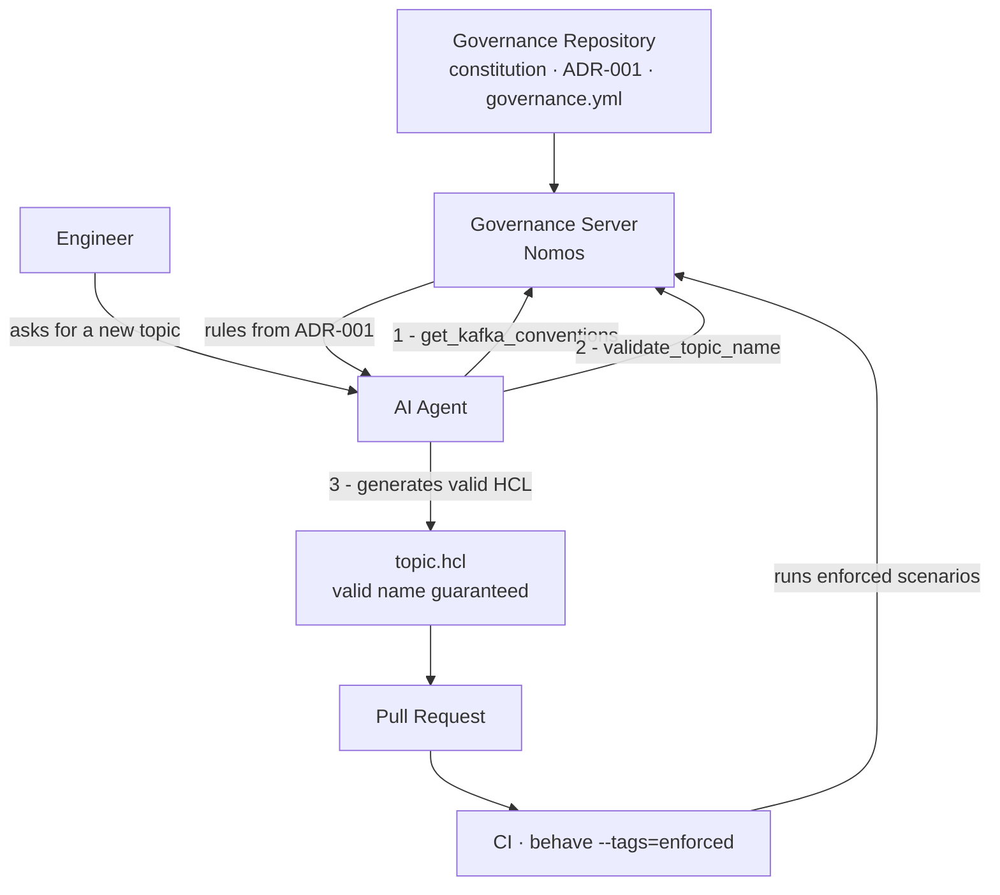

# Example: Kafka Platform Governance

This example shows how Constitutional Governance applies to an event streaming platform.

The platform team owns the Kafka cluster and sets the rules. Product teams own their topics, schemas, and service accounts and must comply with those rules. AI agents assisting product engineers query the governance server to learn what is allowed before generating HCL, YAML, or configuration.

---

## The governance repository structure

```
governance-repo/
├── governance.yml
├── constitution.md
├── constitutions/
│   └── kafka.md
├── adrs/
│   └── global/
│       ├── 001-topic-naming.md
│       ├── 002-consumer-group-naming.md
│       ├── 003-schema-compatibility.md
│       └── 004-rbac-roles.md
├── features/
│   └── kafka/
│       ├── topic-naming.feature        @enforced
│       ├── consumer-group-naming.feature  @wip
│       ├── schema-compatibility.feature   @enforced
│       └── rbac-rules.feature          @enforced
└── conventions/
    └── helm/
        └── kafka-processor-values.yml
```

---

## The constitution (`constitutions/kafka.md`)

```markdown
# Kafka Platform Constitution

## Purpose

The Kafka platform exists to provide reliable, observable, and access-controlled
event streaming to all product teams. Topics are the primary artifact. They are
long-lived, append-only, and governed by the platform team.

## Non-negotiable invariants

1. Topic names encode access control. The prefix determines who can read, write,
   and manage the topic. Validators enforce prefix validity.

2. Schemas are backward-compatible by default. Producers may not break consumers.
   The schema registry enforces compatibility mode; the CI suite verifies it.

3. Service accounts have one purpose each. An SA that consumes from a topic may
   not also produce to it. Shared SAs are prohibited.

4. Retention is set by prefix, not by team preference. Teams may request longer
   retention through an ADR amendment, not by overriding config.
```

---

## A naming convention ADR (`adrs/global/001-topic-naming.md`)

```markdown
# ADR-001: Topic Naming Convention

**Status:** Accepted
**Date:** 2024-01-15

## Decision

Topic names follow the pattern:
`{prefix}.{business-unit}.{system}.{team}.{subdomain}.{entity}.{version}`

7 dot-separated segments. All lowercase. No underscores.

## Rationale

Segment 1 (prefix) drives retention defaults and RBAC boundaries.
Segments 2–5 encode organizational ownership, enabling automated ACL generation.
Segments 6–7 encode the data contract (entity + schema version).

Encoding ownership in the name eliminates a class of access control bugs where
a team accidentally grants access to another team's topics.

## Alternatives rejected

**Free-form names:** Rejected. Without structure, access control cannot be
derived from the name. Every new topic requires manual ACL configuration.

**Shorter names (5 segments):** Rejected. Removing team/subdomain segments
makes it impossible to distinguish topics owned by different teams in the
same system.

## Consequences

Names are validated at commit time (pre-commit hook) and at CI time
(Gherkin scenario `@enforced`). Invalid names block merges.
```

---

## A Gherkin check (`features/kafka/topic-naming.feature`)

```gherkin
@kafka @enforced
Feature: Kafka topic naming convention

  Background:
    Given the Kafka topic naming rules from ADR-001

  @enforced
  Scenario: Valid topic name is accepted
    Given the topic name "raw.payments.pos.checkout.receipts.transaction.v1"
    When I validate the topic name
    Then it should be valid

  @enforced
  Scenario: Topic name with wrong segment count is rejected
    Given the topic name "raw.payments.transaction.v1"
    When I validate the topic name
    Then it should be invalid
    And the reason should mention "expected 7 segments"

  @enforced
  Scenario: Topic name with invalid prefix is rejected
    Given the topic name "internal.payments.pos.checkout.receipts.transaction.v1"
    When I validate the topic name
    Then it should be invalid
    And the reason should mention "invalid prefix"

  @wip
  Scenario: Topic name with uppercase letters is rejected
    Given the topic name "Raw.payments.pos.checkout.receipts.transaction.v1"
    When I validate the topic name
    Then it should be invalid
```

---

## How governance flows to the team



## What the AI agent experience looks like

An engineer asks their AI agent to create a new Kafka topic for payment receipts.

The agent queries the governance server:

```
get_constitution("kafka")
→ "Topic names encode access control. The prefix determines who can read, write..."

get_naming_convention("kafka_topic")
→ pattern: "{prefix}.{business-unit}.{system}.{team}.{subdomain}.{entity}.{version}"
→ examples: ["raw.payments.pos.checkout.receipts.transaction.v1", ...]
→ adr_ref: "ADR-001"

validate_topic_name("raw.payments.pos.checkout.receipts.receipt.v1")
→ {valid: true}
```

The agent generates the topic with the valid name. No review cycle needed for the name.

If the engineer had guessed a name with 5 segments, the agent would have caught it before generating the HCL, not in a CI check.

---

## What the CI experience looks like

Every pull request runs:

```bash
behave features/kafka/ --tags=enforced
```

If a new topic in the PR has an invalid name, the scenario `Topic name with wrong segment count is rejected` fails. The build blocks. The engineer sees exactly which rule was violated and why.

---

→ [Back to README](../README.md) | [REST API example](rest-api.md)
