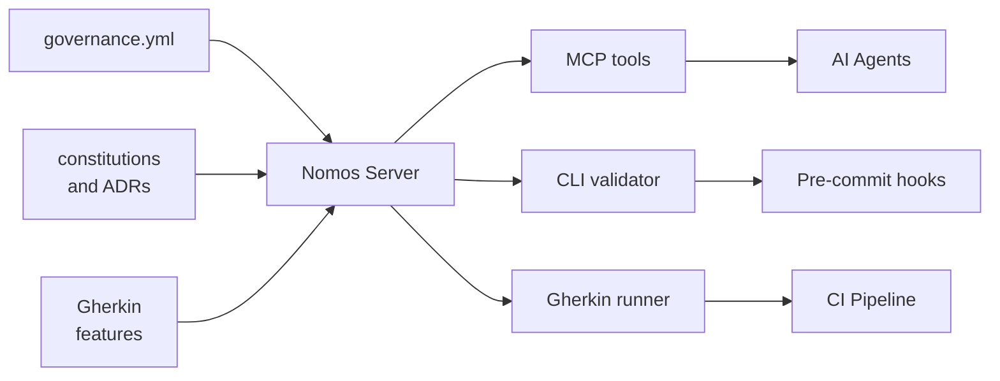

# Nomos — Reference Implementation

**Nomos** is the open-source governance server that operationalizes Constitutional Governance for engineering platforms.

It provides three interfaces to the same governance rules:

| Interface | Use case |
|---|---|
| **MCP tools** | AI agents query rules before and during code generation |
| **CLI** | Pre-commit hooks validate local changes |
| **Gherkin suite** | CI pipeline verifies compliance on every pull request |

---

## What Nomos does

Nomos reads a governance repository — a directory containing a `governance.yml`, constitutions, ADRs, validators, and Gherkin feature files — and exposes its rules as queryable, executable tools.

**For AI agents:**

```
list_constitutions()        → ["global", "kafka", "camel", "springboot"]
get_constitution("kafka")   → {domain, content, version}
list_adrs()                 → [{id, title, status}, ...]
get_adr("001")              → {id, title, status, content}
validate_topic_name("...")  → {valid, reason, pattern}
validate_rbac_entry({...})  → {valid, violations}
get_kafka_conventions()     → {valid_prefixes, valid_roles, prefix_semantics, ...}
list_check_domains()        → ["kafka", "camel", "springboot"]
get_checks("kafka")         → [{title, status, path}, ...]
get_active_rules()          → full governance.yml as structured object
```

**For pre-commit hooks:**

```bash
nomos validate topic "payments.processed.v1"
nomos validate rbac --file domain/team/rbac.hcl
nomos lint --path domain/team/
```

**For CI:**

```bash
behave features/ --tags=enforced
```

---

## Architecture



```
governance repo/
├── governance.yml          ← single config driving all validators
├── constitution.md         ← global principles
├── constitutions/
│   ├── kafka.md
│   ├── camel.md
│   └── springboot.md
├── adrs/
│   ├── global/
│   │   ├── 001-topic-naming.md
│   │   └── 002-consumer-groups.md
│   └── kafka/
├── features/
│   ├── kafka/
│   │   ├── topic-naming.feature
│   │   └── rbac-rules.feature
│   └── springboot/
└── conventions/
    └── helm/
```

Nomos mounts this repo at startup and serves its rules. The governance repo is the authority — Nomos is the transport.

---

## The delegation model

Teams do not run their own governance server. They point their tools and agents at the shared governance server operated by the platform team:

```json
{
  "mcpServers": {
    "governance": {
      "command": "uvx",
      "args": ["nomos"],
      "env": {
        "GOVERNANCE_REPO_PATH": "/path/to/governance-repo"
      }
    }
  }
}
```

When a rule changes in the governance repo, every agent that queries the server gets the updated rule immediately. No redistribution. No stale copies.

---

## Status

Nomos is in active development. The core MCP interface, CLI validators, and Gherkin runner are functional.

→ [GitHub repository](https://github.com/your-org/nomos) *(update this link)*

---

## Other implementations

Constitutional Governance does not require Nomos. The methodology can be implemented with:

- **OPA (Open Policy Agent)** — for teams already invested in the OPA ecosystem
- **Custom scripts** — a shell script that validates names against a YAML config is a valid Constitutional Governance implementation
- **Backstage plugins** — for organizations using Backstage as the developer portal
- **Any tool that exposes governance rules as queryable, machine-readable APIs**

The standard is the methodology. Nomos is one path to it.

---

→ [Back to README](../README.md)
